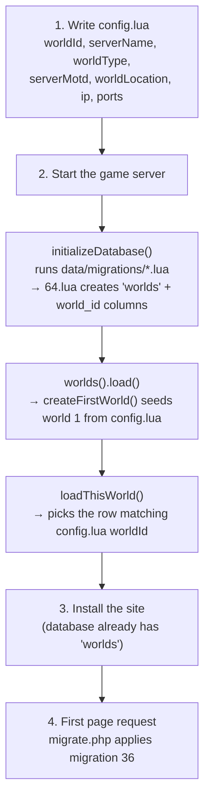

# Multiworld

How the multiworld system is split between the game server and this site, and in
which order things must be set up.

## The rule: each side migrates only what it owns

| Owner | Owns | Created by |
| --- | --- | --- |
| Game server | The `worlds` table and its rows | `schema.sql`, or migration `64.lua` on an existing database |
| Game server | `world_id` on `players`, `guilds`, `houses`, `house_lists`, `players_online`, `account_viplist`, `market_offers`, `market_history`, `tile_store`, `server_config` | migration `64.lua` |
| Site (MyAAC) | `world_id` on `myaac_config`, the `(name, world_id)` unique index, the foreign key, the "Worlds" menu entry | `system/migrations/36.php` |

The dependency runs one way only: **server → database → site**. The site never
creates or seeds game structure. It connects to a database the server has
already prepared.

## Setup order



### 1. Write `config.lua`

The first world is built from these values, so get them right before the first
start:

```lua
worldId = 1
worldType = "pvp"                -- no-pvp, pvp, retro-pvp, pvp-enforced, retro-hardcore
worldLocation = "South America"  -- Europe, North America, South America, Oceania
ip = "127.0.0.1"
gameProtocolPort = 7172
serverName = "Crystal"
serverMotd = "Welcome to the Crystal Server!"
```

### 2. Start the game server

`CrystalServer::run()` does three relevant things, in this order
(`src/crystalserver.cpp`):

1. `initializeDatabase()` → `DatabaseManager::updateDatabase()` runs the Lua
   migrations. Migration `64.lua` creates the `worlds` table and adds `world_id`
   to the game tables. It seeds nothing, and it does not need to: the whole
   migration runs under `SET FOREIGN_KEY_CHECKS=0`, so the `ADD FOREIGN KEY`
   statements succeed even while `worlds` is still empty.
2. `g_game().worlds().load()` → `IOLoginData::createFirstWorld()`. **If, and only
   if, `worlds` is empty**, it inserts world 1 using the `config.lua` values
   above.
3. `loadThisWorld()` reads `worldId` from `config.lua` and looks that row up. If
   there is no such world, startup aborts with `Unknown world with ID N`.

The server binds its game port and its status port from the `worlds` row of the
world it is running, not from `config.lua`.

### 3. Install the site

Point the installer at the same database. Because the server already ran, the
`worlds` table exists and is populated.

### 4. First page request

`migrate.php` runs before `status.php` and `login.php` in both entry points
(`index.php` and `admin/index.php`), so the site's own migrations are applied
before any code that depends on the migrated schema.

## Why the site must not seed `worlds`

`createFirstWorld()` only fires when the table is empty. If the site inserted a
default world first, the server would skip that block entirely and every value
in the user's `config.lua` — server name, world type, motd, location, ip, port —
would be silently discarded. The site would have quietly overridden the server's
configuration.

This is why migration 36 no longer contains a `CREATE TABLE worlds` or a seed.

## Adding a second world

There is no admin UI for this yet. Insert the row by hand:

```sql
INSERT INTO `worlds` (`name`, `type`, `motd`, `location`, `ip`, `port`, `port_status`, `creation`)
VALUES ('Secondary', 'pvp', 'Welcome!', 'South America', '127.0.0.1', 7182, 7183, UNIX_TIMESTAMP());
```

Then run a second server instance with its own `config.lua` pointing at it:

```lua
worldId = 2
gameProtocolPort = 7182
```

One server process serves exactly one world. Both processes share the same
database, and the site reads all of them from the `worlds` table.

## Troubleshooting

**`Base table or view not found: 1146 Table '<db>.worlds' doesn't exist`**

The site is talking to a database the server has never prepared. Either import
the current `schema.sql`, or start the game server once against the existing
database so migration `64.lua` runs. Then reload the site.

**`Unknown world with ID N` on server startup**

`config.lua` has a `worldId` with no matching row in `worlds`. Check the table
and either fix `worldId` or insert the missing world.

**The site shows a world as offline even though it is up**

The site queries the port stored in `worlds.port_status`, and the server binds
that same value. Note that the two server seed paths currently disagree —
`schema.sql` seeds `7173`, while `createFirstWorld()` derives it as `9` +
`gameProtocolPort` (so `97172` with the default port). Check what is actually in
the row and make sure it is the port you intend to expose.
